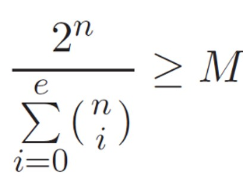
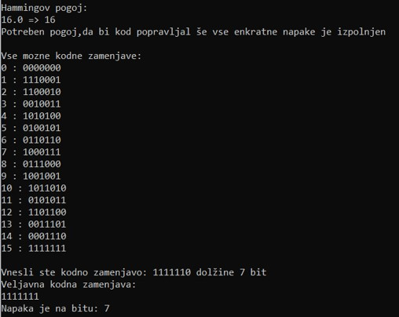

# Hammingov pogoj

* M --> število kodnih zamenjav  
* n > k dolžina kodnih zamenjav 
* e --> najmanjše število napak, ki jih s kodom še lahko popravimo 
# Rezultat

# Zagon programa
* Beri komentarje v programu

